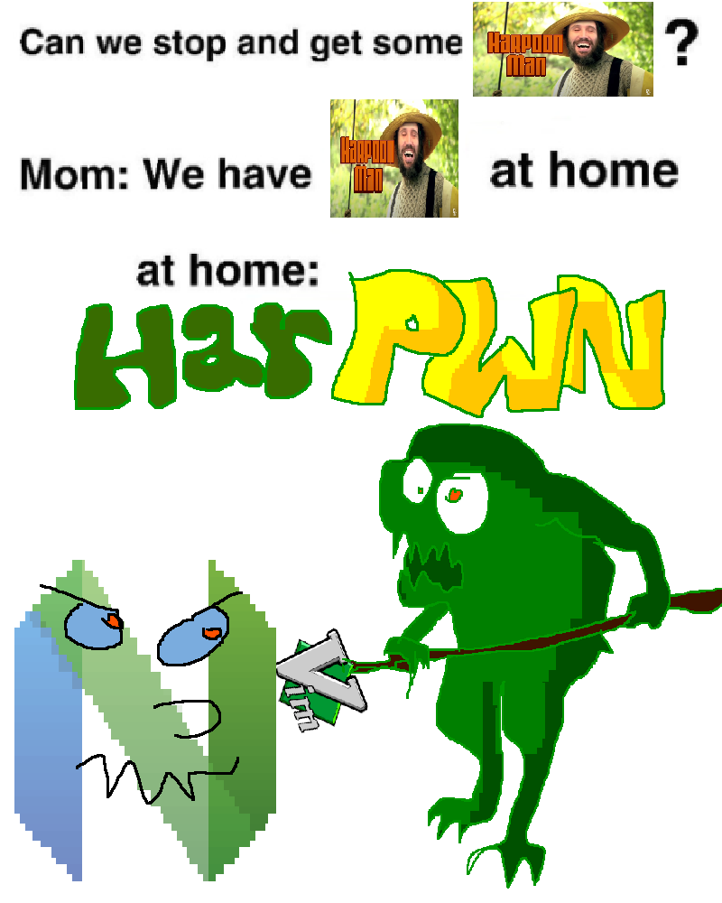

# Harpwn
Harpoon wanna be



## Descriptions

In case you don't know what Harpoon is

It is buffer/windows manager, this is a clone that work on Vim

doesn't have all the features the original does
[Harpoon](https://github.com/ThePrimeagen/harpoon)
, also Harpoon only works on Neovim, mine kind of work on Neovim, but it super buggy and I gave up on trying to fix it.

Popups are now available on neovim. :(

This plugin allows you to pin up to 10 buffers/windows

Then you can either cycle thru them very fast or use the menu to jump to them using the number keys from 1 to 0

Unfortunately this is my first plugin and I don't know how to do persistence in order to keep the pinned files in the list, especially if used across multiple sessions...


### Instalation

I don't know how other plugin managers work\
But here is copy paste for you

```
Plug('c64cosmin/harpwn.vim')
```

### Help

To get more info directly in Vim

```vim
:help harpwn
```

### Easy setup

This is my own configuration

To add a new buffer just press `+`

To open the menu you press `-`

You can move fast through them using `<` and `>`

```vim
nnoremap <silent> + :HarpwnAdd<CR>
nnoremap <silent> - :HarpwnMenu<CR>
nnoremap <silent> > :HarpwnNext 1<CR>
nnoremap <silent> < :HarpwnNext -1<CR>
```

### Setup with more control

To assign the current buffer to the list just press `<Leader>H`\
\
You can also assign a buffer to a number key by tapping `<Leader>H{num}`\
This will assign the current opened buffer to {num}\
\
To get back to that buffer you just press `g{num}`\
\
You can move fast through them using `<` and `>`\
\
To open the menu you can just use `<Leader>h`


```vim
nnoremap <silent> <Leader>H :HarpwnAdd<CR>
nnoremap <silent> <Leader>h :HarpwnMenu<CR>
nnoremap <silent> > :HarpwnNext 1<CR>
nnoremap <silent> < :HarpwnNext -1<CR>
nnoremap <silent> g1 :HarpwnGo 0<CR>
nnoremap <silent> g2 :HarpwnGo 1<CR>
nnoremap <silent> g3 :HarpwnGo 2<CR>
nnoremap <silent> g4 :HarpwnGo 3<CR>
nnoremap <silent> g5 :HarpwnGo 4<CR>
nnoremap <silent> g6 :HarpwnGo 5<CR>
nnoremap <silent> g7 :HarpwnGo 6<CR>
nnoremap <silent> g8 :HarpwnGo 7<CR>
nnoremap <silent> g9 :HarpwnGo 8<CR>
nnoremap <silent> g0 :HarpwnGo 9<CR>
nnoremap <silent> <Leader>H1 :HarpwnSet 0<CR>
nnoremap <silent> <Leader>H2 :HarpwnSet 1<CR>
nnoremap <silent> <Leader>H3 :HarpwnSet 2<CR>
nnoremap <silent> <Leader>H4 :HarpwnSet 3<CR>
nnoremap <silent> <Leader>H5 :HarpwnSet 4<CR>
nnoremap <silent> <Leader>H6 :HarpwnSet 5<CR>
nnoremap <silent> <Leader>H7 :HarpwnSet 6<CR>
nnoremap <silent> <Leader>H8 :HarpwnSet 7<CR>
nnoremap <silent> <Leader>H9 :HarpwnSet 8<CR>
nnoremap <silent> <Leader>H0 :HarpwnSet 9<CR>
```

## Self-Promotion

I make video games

[Twitter](http://twitter.com/c64cosmin)

[YouTube](https://www.youtube.com/@c64cosmin)

You can play some free games here\
No download, directly in browser\
Hope you get a high score in the leader board :D

[HomePage](https://stupidrat.com)

## License

Copyright (c) Cosmin MUNTEANU.  Distributed under the same terms as Vim itself.
See `:help license`.
